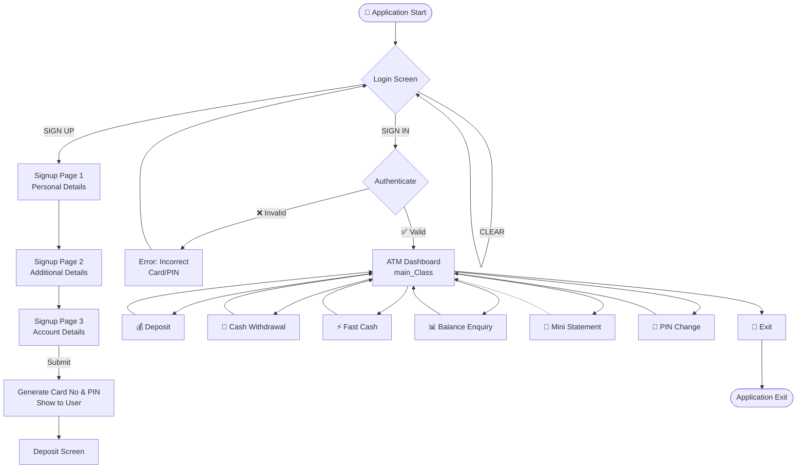

<p align="center">
  
</p>

<h1 align="center">🏦 KAJIPARA BANK OF INDIA</h1>
<h3 align="center">ATM Simulation — Bank Management System</h3>

<p align="center">
  
  
  
  
  
</p>

<p align="center">
  A fully-functional <b>ATM Simulator / Bank Management System</b> built in <b>Java</b> with a <b>Swing GUI</b> and <b>MySQL</b> database backend.<br/>
  Simulates real-world ATM banking operations including account creation, login, deposits, withdrawals, fast cash, balance enquiry, mini statements, and PIN management.
</p>

---

## 📑 Table of Contents

- [Features](#-features)
- [Architecture](#-architecture)
  - [High-Level Architecture](#high-level-architecture)
  - [Module Dependency Graph](#module-dependency-graph)
  - [User Flow](#user-flow)
  - [Database Schema (ER Diagram)](#database-schema-er-diagram)
- [Project Structure](#-project-structure)
- [Tech Stack](#-tech-stack)
- [Prerequisites](#-prerequisites)
- [Database Setup](#-database-setup)
- [How to Run](#-how-to-run)
- [Screenshots](#-screenshots)
- [Module Details](#-module-details)
- [Future Enhancements](#-future-enhancements)
- [Contributing](#-contributing)
- [License](#-license)
- [Author](#-author)

---

## ✨ Features

| Feature | Description |
|---|---|
| 🔐 **Secure Login** | Card number + PIN based authentication |
| 📝 **Multi-Step Sign Up** | 3-page registration form collecting personal, additional, and account details |
| 💰 **Deposit** | Deposit any amount into your account |
| 💸 **Cash Withdrawal** | Withdraw amount with balance validation (max ₹10,000) |
| ⚡ **Fast Cash** | Quick withdrawal with preset amounts (₹100 – ₹10,000) |
| 📊 **Balance Enquiry** | Check your current account balance |
| 📜 **Mini Statement** | View recent transaction history with running balance |
| 🔑 **PIN Change** | Securely update your ATM PIN |
| 🎨 **ATM-Style GUI** | Realistic ATM interface with background images |

---

## 🏗 Architecture

### High-Level Architecture

```
┌──────────────────────────────────────────────────────────────────┐
│                    PRESENTATION LAYER (Swing GUI)                │
│                                                                  │
│  ┌──────────┐  ┌──────────┐  ┌──────────┐  ┌──────────────────┐ │
│  │  Login    │  │ Signup   │  │ Signup2  │  │    Signup3       │ │
│  │  Screen   │──│ Page 1   │──│ Page 2   │──│    Page 3        │ │
│  └────┬─────┘  └──────────┘  └──────────┘  └───────┬──────────┘ │
│       │                                             │            │
│       ▼                                             ▼            │
│  ┌─────────────────────────────────────────────────────────────┐ │
│  │                   main_Class (ATM Dashboard)                │ │
│  │   ┌─────────┐ ┌───────────┐ ┌──────────┐ ┌──────────────┐  │ │
│  │   │ Deposit │ │ Withdrawl │ │ FastCash │ │BalanceEnquriy│  │ │
│  │   └─────────┘ └───────────┘ └──────────┘ └──────────────┘  │ │
│  │   ┌─────────┐ ┌───────────┐                                │ │
│  │   │   Pin   │ │   mini    │                                │ │
│  │   └─────────┘ └───────────┘                                │ │
│  └─────────────────────────────────────────────────────────────┘ │
└────────────────────────────┬─────────────────────────────────────┘
                             │
                    ┌────────▼────────┐
                    │   DATA ACCESS   │
                    │   LAYER (JDBC)  │
                    │                 │
                    │   Connn.java    │
                    │  (DB Connector) │
                    └────────┬────────┘
                             │
                    ┌────────▼────────┐
                    │   DATABASE      │
                    │   LAYER         │
                    │                 │
                    │  MySQL 8.0      │
                    │  bankSystem DB  │
                    └─────────────────┘
```

### Module Dependency Graph

```
                        Login.java
                       /          \
                      /            \
              Signup.java      main_Class.java ◄──────────────────┐
                  │              /  |  |  \  \                    │
              Signup2.java      /   |  |   \  \                   │
                  │            /    |  |    \   \                  │
              Signup3.java    /     |  |     \   \                 │
                  │          /      |  |      \   \                │
                  ▼         ▼       ▼  ▼       ▼   ▼               │
              Deposit  Withdrawl  FastCash  Pin  mini  BalanceEnquriy
                  │       │         │        │                     │
                  └───────┴─────────┴────────┴─────────────────────┘
                              (all navigate back)

              ════════════════════════════════════════
              All modules use  Connn.java  for DB access
              ════════════════════════════════════════
```

### User Flow



### Database Schema (ER Diagram)

```
┌───────────────────────────────────────────────────────────────┐
│                        bankSystem (Database)                  │
├───────────────────────────────────────────────────────────────┤
│                                                               │
│  ┌─────────────────────────────────────────┐                  │
│  │              signup                     │                  │
│  ├─────────────────────────────────────────┤                  │
│  │ from_no        VARCHAR(30) [FK]         │                  │
│  │ name           VARCHAR(30)              │                  │
│  │ father_name    VARCHAR(30)              │                  │
│  │ DOB            VARCHAR(30)              │                  │
│  │ gender         VARCHAR(30)              │                  │
│  │ email          VARCHAR(60)              │                  │
│  │ marital_status VARCHAR(30)              │                  │
│  │ address        VARCHAR(600)             │                  │
│  │ city           VARCHAR(100)             │                  │
│  │ pincode        VARCHAR(30)              │                  │
│  │ state          VARCHAR(50)              │                  │
│  └──────────────────┬──────────────────────┘                  │
│                     │ from_no                                 │
│                     ▼                                         │
│  ┌─────────────────────────────────────────┐                  │
│  │             signuptwo                   │                  │
│  ├─────────────────────────────────────────┤                  │
│  │ from_no          VARCHAR(30) [FK]       │                  │
│  │ religion         VARCHAR(30)            │                  │
│  │ category         VARCHAR(30)            │                  │
│  │ income           VARCHAR(30)            │                  │
│  │ education        VARCHAR(30)            │                  │
│  │ occupation       VARCHAR(60)            │                  │
│  │ pan              VARCHAR(30)            │                  │
│  │ aadhar           VARCHAR(600)           │                  │
│  │ seiorcitizen     VARCHAR(100)           │                  │
│  │ existing_account VARCHAR(30)            │                  │
│  └──────────────────┬──────────────────────┘                  │
│                     │ from_no                                 │
│                     ▼                                         │
│  ┌─────────────────────────────────────────┐                  │
│  │            signupthree                  │                  │
│  ├─────────────────────────────────────────┤                  │
│  │ from_no      VARCHAR(30) [FK]           │                  │
│  │ account_Type VARCHAR(40)                │                  │
│  │ card_number  VARCHAR(30)                │──┐               │
│  │ pin          VARCHAR(30)                │──┼──┐            │
│  │ facility     VARCHAR(200)               │  │  │            │
│  └─────────────────────────────────────────┘  │  │            │
│                                               │  │            │
│  ┌─────────────────────────────────────────┐  │  │            │
│  │               login                     │  │  │            │
│  ├─────────────────────────────────────────┤  │  │            │
│  │ from_no      VARCHAR(30)                │  │  │            │
│  │ card_number  VARCHAR(30)  ◄─────────────┘  │  │            │
│  │ pin          VARCHAR(30)  ◄────────────────┘  │            │
│  └─────────────────────────────────────────┘     │            │
│                                                  │            │
│  ┌─────────────────────────────────────────┐     │            │
│  │                bank                     │     │            │
│  ├─────────────────────────────────────────┤     │            │
│  │ pin      VARCHAR(10)    ◄─────────────────────┘            │
│  │ date     VARCHAR(50)                    │                  │
│  │ type     VARCHAR(20)  [Deposit/Withdrawl] │                │
│  │ amount   VARCHAR(20)                    │                  │
│  └─────────────────────────────────────────┘                  │
│                                                               │
└───────────────────────────────────────────────────────────────┘
```

---

## 📁 Project Structure

```
KAJIPARA BANK OF INDIA/
│
├── src/
│   ├── bank/management/system/        # Main source package
│   │   ├── Login.java                 # 🔐 Entry point — Login screen
│   │   ├── Signup.java                # 📝 Registration Page 1 (Personal Details)
│   │   ├── Signup2.java               # 📝 Registration Page 2 (Additional Details)
│   │   ├── Signup3.java               # 📝 Registration Page 3 (Account Details)
│   │   ├── main_Class.java            # 🏧 ATM Dashboard (Transaction Menu)
│   │   ├── Deposit.java               # 💰 Deposit money
│   │   ├── Withdrawl.java             # 💸 Withdraw money (with balance check)
│   │   ├── FastCash.java              # ⚡ Quick withdrawal (preset amounts)
│   │   ├── BalanceEnquriy.java         # 📊 Check current balance
│   │   ├── mini.java                  # 📜 Mini statement (transaction history)
│   │   ├── Pin.java                   # 🔑 Change PIN
│   │   └── Connn.java                 # 🔗 Database connection utility (JDBC)
│   │
│   └── icon/                          # Static assets
│       ├── atm2.jpg                   # ATM background image
│       ├── backbg.png                 # Login background
│       ├── bank.png                   # Bank logo icon
│       ├── card.png                   # Card illustration
│       └── provider.png               # Provider icon
│
├── sql/
│   └── New Text Document.txt          # 🗃 Database schema (SQL DDL scripts)
│
├── .gitignore                         # Git ignore configuration
└── README.md                          # 📖 This file
```

---

## 🛠 Tech Stack

| Layer | Technology |
|---|---|
| **Language** | Java (JDK 8+) |
| **GUI Framework** | Java Swing (javax.swing) |
| **Database** | MySQL 8.0 |
| **DB Connectivity** | JDBC (mysql-connector-java 8.0.28) |
| **Date Picker** | JCalendar (jcalendar-tz-1.3.3-4) |
| **IDE** | IntelliJ IDEA |

---

## 📋 Prerequisites

Before running this project, ensure you have the following installed:

- ☕ **Java JDK 8** or higher — [Download](https://www.oracle.com/java/technologies/downloads/)
- 🐬 **MySQL 8.0** — [Download](https://dev.mysql.com/downloads/installer/)
- 💡 **IntelliJ IDEA** (recommended) — [Download](https://www.jetbrains.com/idea/download/)
- 📦 **MySQL Connector/J 8.0.28** — [Download](https://dev.mysql.com/downloads/connector/j/)
- 📅 **JCalendar Library** — [Download](https://toedter.com/jcalendar/)

---

## 🗃 Database Setup

1. **Open MySQL** and create the database:

```sql
CREATE DATABASE bankSystem;
USE bankSystem;
```

2. **Create the required tables:**

```sql
-- Table: signup (Personal Details - Page 1)
CREATE TABLE signup (
    from_no        VARCHAR(30),
    name           VARCHAR(30),
    father_name    VARCHAR(30),
    DOB            VARCHAR(30),
    gender         VARCHAR(30),
    email          VARCHAR(60),
    marital_status VARCHAR(30),
    address        VARCHAR(600),
    city           VARCHAR(100),
    pincode        VARCHAR(30),
    state          VARCHAR(50)
);

-- Table: signuptwo (Additional Details - Page 2)
CREATE TABLE signuptwo (
    from_no          VARCHAR(30),
    religion         VARCHAR(30),
    category         VARCHAR(30),
    income           VARCHAR(30),
    education        VARCHAR(30),
    occupation       VARCHAR(60),
    pan              VARCHAR(30),
    aadhar           VARCHAR(600),
    seiorcitizen     VARCHAR(100),
    existing_account VARCHAR(30)
);

-- Table: signupthree (Account Details - Page 3)
CREATE TABLE signupthree (
    from_no      VARCHAR(30),
    account_Type VARCHAR(40),
    card_number  VARCHAR(30),
    pin          VARCHAR(30),
    facility     VARCHAR(200)
);

-- Table: login (Authentication)
CREATE TABLE login (
    from_no     VARCHAR(30),
    card_number VARCHAR(30),
    pin         VARCHAR(30)
);

-- Table: bank (Transaction Ledger)
CREATE TABLE bank (
    pin    VARCHAR(10),
    date   VARCHAR(50),
    type   VARCHAR(20),
    amount VARCHAR(20)
);
```

3. **Update credentials** in `Connn.java` if your MySQL username/password is different:

```java
connection = DriverManager.getConnection(
    "jdbc:mysql://localhost:3306/bankSystem",
    "root",           // ← your MySQL username
    "your_password"   // ← your MySQL password
);
```

---

## 🚀 How to Run

### Using IntelliJ IDEA (Recommended)

1. **Clone the repository:**
   ```bash
   git clone https://github.com/YOUR_USERNAME/KAJIPARA-BANK-OF-INDIA.git
   ```

2. **Open** the project in IntelliJ IDEA.

3. **Add external libraries** to the project:
   - `mysql-connector-java-8.0.28.jar`
   - `jcalendar-tz-1.3.3-4.jar`
   - Go to **File → Project Structure → Libraries → + → Java** and add the JAR files.

4. **Set up** the MySQL database (see [Database Setup](#-database-setup) above).

5. **Run** `Login.java` as the entry point:
   - Right-click `Login.java` → **Run 'Login.main()'**

### Using Command Line

```bash
# Compile (ensure JARs are in the classpath)
javac -cp ".;mysql-connector-java-8.0.28.jar;jcalendar-tz-1.3.3-4.jar" src/bank/management/system/*.java

# Run
java -cp ".;src;mysql-connector-java-8.0.28.jar;jcalendar-tz-1.3.3-4.jar" bank.management.system.Login
```

---

## 📸 Screenshots

| Screen | Description |
|---|---|
| **Login Screen** | ATM-style login with Card No & PIN fields |
| **Sign Up (3 Pages)** | Multi-step account creation wizard |
| **ATM Dashboard** | Transaction selection menu |
| **Deposit / Withdrawal** | Enter amount, submit transaction |
| **Fast Cash** | Quick withdrawal with preset buttons |
| **Mini Statement** | Transaction history with balance |
| **Balance Enquiry** | Current account balance display |
| **PIN Change** | Secure PIN update form |

> 💡 *Add actual screenshots by placing them in a `/screenshots` folder and updating the paths above.*

---

## 📦 Module Details

### 🔗 `Connn.java` — Database Connector
Central JDBC utility class. Creates a `Connection` and `Statement` object connected to the MySQL `bankSystem` database. All other modules instantiate this class to execute SQL queries.

### 🔐 `Login.java` — Entry Point
The application's main entry point. Displays an ATM-themed login screen with:
- Card Number text field
- PIN password field
- Sign In, Clear, and Sign Up buttons
- Validates credentials against the `login` table

### 📝 `Signup.java` → `Signup2.java` → `Signup3.java` — Registration Wizard
A 3-page multi-step form:
- **Page 1**: Name, Father's Name, DOB, Gender, Email, Marital Status, Address, City, Pin, State
- **Page 2**: Religion, Category, Income, Education, Occupation, PAN, Aadhar, Senior Citizen, Existing Account
- **Page 3**: Account Type, Auto-generated Card Number & PIN, Service selection (ATM Card, Internet Banking, etc.)

### 🏧 `main_Class.java` — ATM Dashboard
The central navigation hub post-login. Provides buttons for all banking transactions and routes to the respective module.

### 💰 `Deposit.java` — Deposit Module
Allows users to deposit any amount. Records the transaction with timestamp in the `bank` table as type `Deposit`.

### 💸 `Withdrawl.java` — Cash Withdrawal
Custom amount withdrawal with **balance validation**. Calculates available balance from all past transactions before processing. Maximum withdrawal is ₹10,000.

### ⚡ `FastCash.java` — Fast Cash
Preset quick-withdrawal buttons: ₹100, ₹500, ₹1,000, ₹2,000, ₹5,000, ₹10,000. Includes balance check before processing.

### 📊 `BalanceEnquriy.java` — Balance Enquiry
Calculates and displays the **current balance** by iterating through all transactions (deposits − withdrawals).

### 📜 `mini.java` — Mini Statement
Shows a scrollable list of recent transactions with date, type, and amount. Also displays a masked card number and total balance.

### 🔑 `Pin.java` — PIN Change
Allows users to change their ATM PIN. Updates the `bank`, `login`, and `signupthree` tables for consistency.

---

## 🔮 Future Enhancements

- [ ] 🔒 Password hashing and SQL injection prevention (PreparedStatements)
- [ ] 🧾 Fund transfer between accounts
- [ ] 📱 Responsive web-based frontend (Spring Boot + React)
- [ ] 📧 Email/SMS OTP verification
- [ ] 📊 Admin panel with analytics dashboard
- [ ] 🧪 Unit tests with JUnit
- [ ] 🐳 Docker containerization
- [ ] 📄 PDF generation for statements

---

## 🤝 Contributing

Contributions are welcome! Here's how:

1. **Fork** the repository
2. **Create** a feature branch: `git checkout -b feature/amazing-feature`
3. **Commit** your changes: `git commit -m 'Add amazing feature'`
4. **Push** to the branch: `git push origin feature/amazing-feature`
5. **Open** a Pull Request

---

## 📄 License

This project is open source and available under the [MIT License](LICENSE).

---

## 👨‍💻 Author

**Lokojit** — *KAJIPARA BANK OF INDIA*

---

<p align="center">
  <b>⭐ Star this repo if you found it helpful! ⭐</b>
</p>
